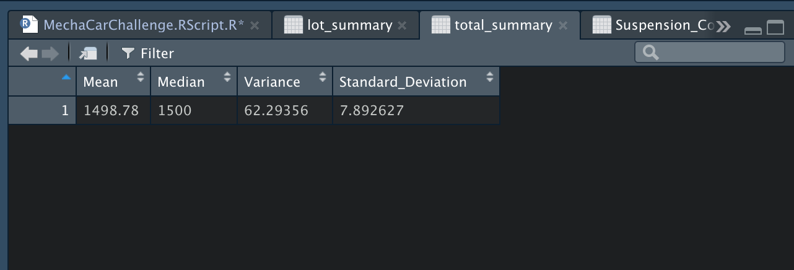

# MechaCar_Statistical_Analysis

## Linear Regression to Predict MPG
---
- Which variables/coefficients provided a non-random amount of variance to the mpg values in the dataset?
    - Vehicle length, ground clearance, and intercept provide non-random amount of variance to the MPG values in the dataset

- Is the slope of the linear model considered to be zero? Why or why not?
    - There is not enough evidence to conclude that the slope of the linear model is zero because vehicle length and ground clearance are non-random and have a statistically significant impact on MPG

- Does this linear model predict mpg of MechaCar prototypes effectively? Why or why not?
    - Intercept is statistically significant and there are other significant variables and factors not included in the model, this linear model fails to predict MPG of MechaCar prototypes effectively

## Summary Statistics on Suspension Coils
---
The design specifications for the MechaCar suspension coils dictate that the variance of the suspension coils must not exceed 100 pounds per square inch. Lot 3 does not meet design specifications, the current manufacturing data for Lot 3 exceeds these specifications. However, all other lots and lots in aggregate do not exceed 100 pounds per square inch and meet design specifications

- `Total Summary`

- `Lot SUmmary`

## T-Tests on Suspension Coils
---

- `T-Test All Lots`

- `T-Test Lot1`

- `T-Test Lot2`

- `T-Test Lot3`

## Study Design: MechaCar vs Competition
---
Conduct a study to quantify how MechaCar's SUV model performs against the competitor 

### Metric:
Horsepower(hp)

### Null and Alternative Hypothesis:
The null hypothesis assumes no statistical difference between the two samples means, and the alternative hypothesis assumes a statistical difference between the two sample means. Failing to reject the null hypothesis will result in a tie, and rejecting the null hypothesis will result in a winner

### Statistical Test:
The SUV with the highest horsepower (hp) sample mean will be the best performer, given that the two sample means are statistically different.
- Calculate the sample means of both SUVs to determine the highest sample mean
- Run a two-sample t-Test to determine if there is a statistical difference between the two sample means and if there is a statistical difference, then the SUV with the highest sample mean will be the best performer

### Data:
To conduct the study, we will need a minimum of 50 horsepower (hp) random samples from each 
 
